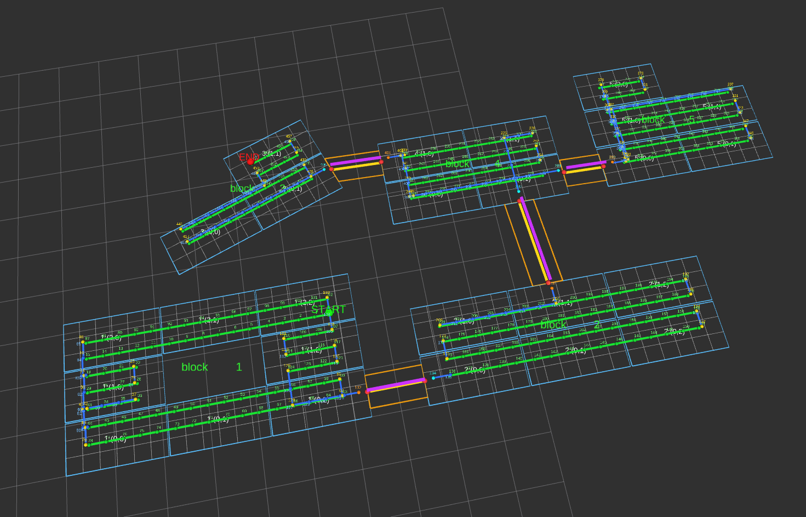
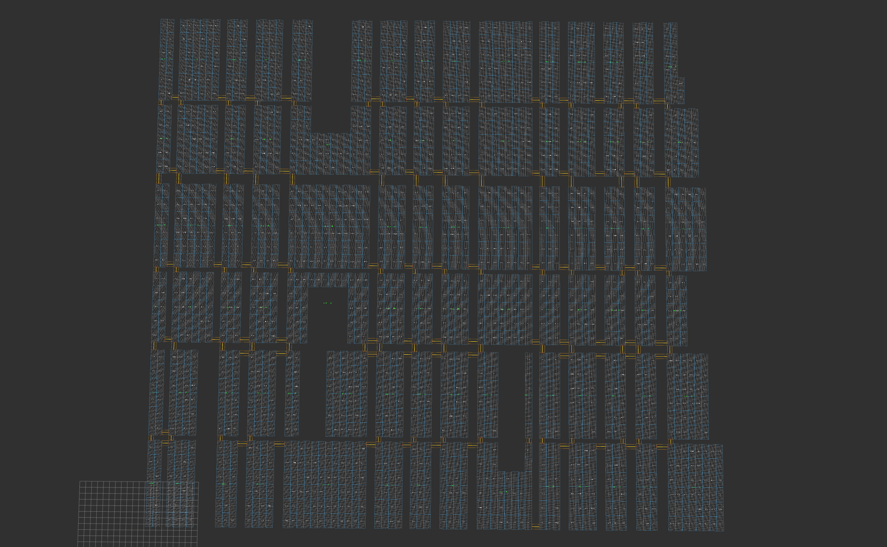
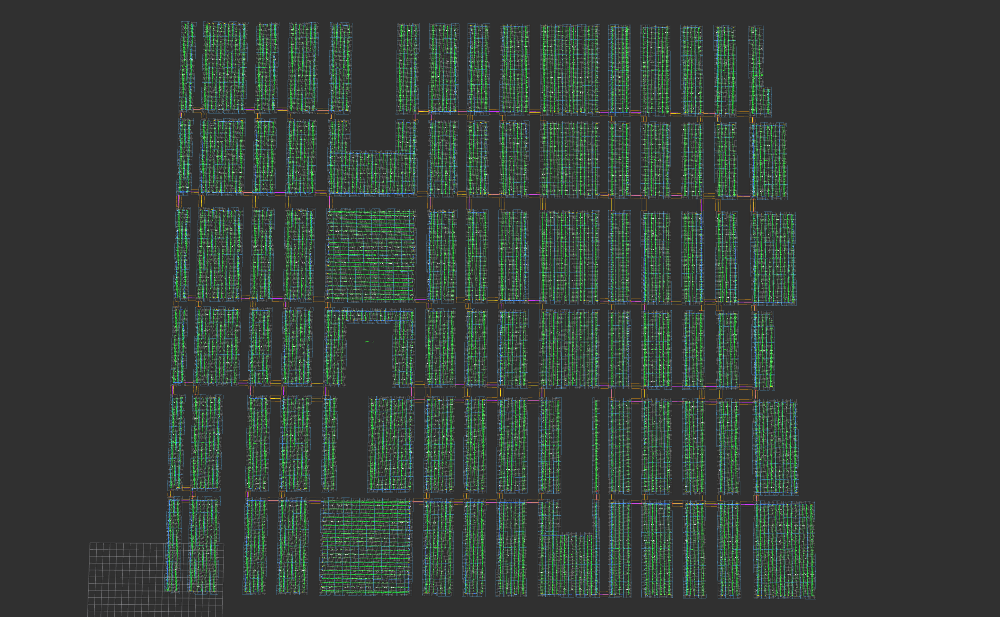
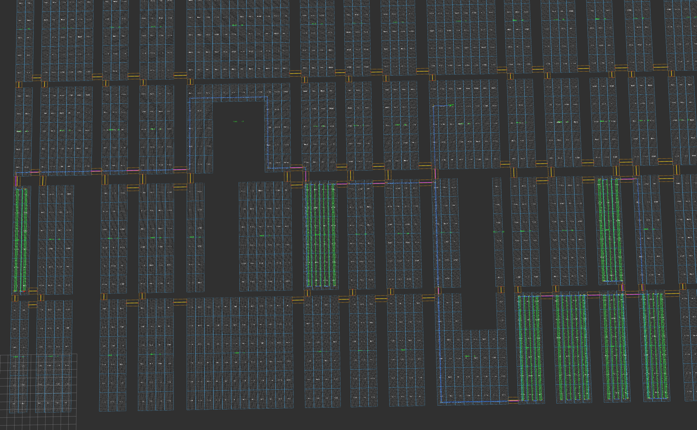
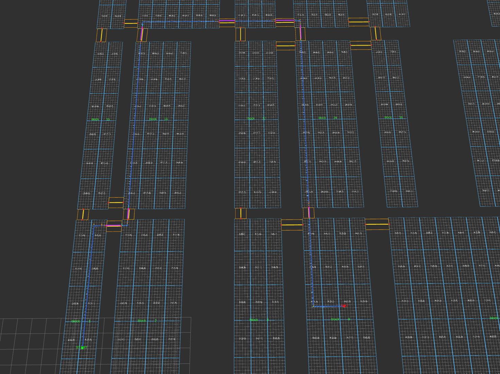

# map_planner 使用说明

`map_planner` 负责光伏阵列静态地图的导入、校验、查询、RViz 显示和路径规划。



## 1. 功能范围

- 从 YAML/JSON 文件导入标准光伏地图
- CAD DXF/DWG 文件自动转换为地图 YAML
- YAML 自动补充 block 间 `bridges[]`
- 通过抽象 `MapImporter` 接口预留其他文件格式导入能力
- 内存中维护 `blocks / cells / bridges / cell_model / frame` 地图模型
- cell 行列和 `cell_id` 互查 service
- 清扫覆盖规划（`/map_planner/plan_coverage_path`）和点到点空驶规划（`/map_planner/plan_transit_path`）
- 中心格可通行性查询（`/map_planner/get_center_poses`）
- 交互式 TUI 规划测试工具（`test_plan_path.py tui`）
- 规划路径 RViz 可视化 `/map_planner/planned_path_markers`

## 2. 地图格式

详见 [`map_representation.md`](map_representation.md)。


核心结构：

```yaml
map_id: 1
version: 1
frame:
  unit: centimeter
  origin: { latitude_deg: 31.12, longitude_deg: 121.12, yaw_deg: 12.5 }
cell_model:
  inner_rows: 3
  inner_cols: 6
blocks: []
bridges: []
cells: []
```

示例地图：`config/example_map.yaml`、`config/example_map_complex.yaml`、`config/example_map_complex.json`。

要点：
- `blocks[].grid[row][col] == 1` 表示存在小板，`0` 表示空位
- 空板不应出现在 `cells[]` 中
- 规划和定位使用 `grid` 行列拓扑和 `cell_model.inner_rows/inner_cols` 内部格子，不依赖固定小板尺寸
- bridge endpoint 绑定到实际小板，使用 `inner_row/inner_col` 表示锚点

## 3. 工具

详见 [`tools/README.md`](tools/README.md)。

| 工具 | 用途 |
|------|------|
| `test_plan_path.py` | CLI（coverage/transit）+ 交互式 TUI 规划测试 |
| `dxf_to_pv_map.py` | CAD DXF/DWG → map_planner YAML 转换 |


| `auto_bridge_yaml.py` | YAML 自动补充 `bridges[]` |

## 4. 导入接口

地图导入通过 `MapImporter` 抽象接口：

```cpp
class MapImporter {
public:
  virtual ~MapImporter() = default;
  virtual bool can_import(const std::string &path) const = 0;
  virtual PvMap import_from_file(const std::string &path) const = 0;
};
```

当前实现：`YamlMapImporter`、`JsonMapImporter`。`JsonMapImporter` 复用 YAML 解析逻辑，字段结构完全相同。

## 5. ROS Topics

### `/pv_map` — 完整静态地图快照

类型 `map_planner/msg/PvMap`，QoS reliable + transient local。

### `/pv_map/markers` — 地图 RViz 可视化

类型 `visualization_msgs/msg/MarkerArray`。显示小板边框、block label、bridge centerline/polygon、内部格线、可选 cell label。

### `/map_planner/planned_path_markers` — 规划路径 RViz 可视化

类型 `visualization_msgs/msg/MarkerArray`。显示最近一次规划结果的 clean/deadhead/turn 路径。

坐标转换：`u_cm / 100.0 → x(m)`，`v_cm / 100.0 → y(m)`，frame 默认 `pv_map`。

## 6. ROS Services

接口设计详见 [`API.md`](API.md)。

| Service | 类型 | 用途 |
|---------|------|------|
| `/map_planner/get_map` | `GetMap` | 返回当前完整地图 |
| `/map_planner/reload_map` | `ReloadMap` | 运行时重载地图 |
| `/map_planner/get_cell_id` | `GetCellId` | block + 行列 → cell_id |
| `/map_planner/get_cell_index` | `GetCellIndex` | cell_id → block + 行列 |
| `/map_planner/get_center_poses` | `GetCenterPoses` | 查询中心格可通行状态（按 block/cell/heading 过滤） |
| `/map_planner/plan_coverage_path` | `PlanCoveragePath` | 清扫覆盖规划 |
| `/map_planner/plan_transit_path` | `PlanTransitPath` | 点到点空驶规划 |

### `/map_planner/plan_coverage_path`

固定起点，生成清扫覆盖路径。`target_block_ids` 空 = 所有 cleanable block。起点到第一个清扫 waypoint 前只输出空驶/过桥，不输出 clean。





### `/map_planner/plan_transit_path`

固定起点终点，生成点到点空驶路径。全程 `brush_on=false`，优先减少转弯次数。`allowed_block_ids` 空 = 所有 cleanable block；`require_goal_heading=false` 时只要求到达终点中心格。



## 7. 路径规划

通过可替换接口实现：

```cpp
class IPathPlanner {
public:
  virtual ~IPathPlanner() = default;
  virtual PlanningResult plan(const MapRepository &repository,
                              const PlanningRequest &request) const = 0;
};
```

当前实现：`GlobalCoveragePlanner`（清扫覆盖）、`TransitPathPlanner`（点到点空驶）。

规划文档详见 [`docs/path_planning.md`](docs/path_planning.md)。

## 8. 配置参数

通过 ROS2 parameter 机制配置。下表为 `MapServerNode` 代码默认值；`map_planner.launch.py` 会覆盖部分参数。

| 参数 | 类型 | 默认值 | 说明 |
|------|------|--------|------|
| `map_file` | string | `""` | 地图文件路径，空则不加载地图 |
| `frame_id` | string | `"pv_map"` | frame_id |
| `publish_rate_hz` | double | `1.0` | 发布频率 |
| `publish_markers` | bool | `true` | 是否发布 RViz MarkerArray |
| `show_cell_labels` | bool | `false` | 是否显示 cell 行列标签 |
| `auto_plan` | bool | `false` | 保留参数，新接口需调用方提供起点 |
| `planning_search_effort` | string | `"balanced"` | `fast` / `balanced` / `quality` / `exhaustive` |
| `debug_score_breakdown` | bool | `false` | 输出候选评分 breakdown |
| `robot_length_cm` | double | `120.0` | 整机长度 cm |
| `front_roller_width_cm` | double | `0.0` | 前滚刷滚桶直径 cm |
| `rear_roller_width_cm` | double | `0.0` | 后滚刷滚桶直径 cm |
| `robot_width_cm` | double | `70.0` | 车体宽度 cm |
| `safety_margin_cm` | double | `10.0` | 安全边距 cm |
| `cleaning_width_cm` | double | `55.0` | 清扫覆盖宽度 cm |
| `overlap_ratio` | double | `0.2` | 相邻 lane 重叠比例 |
| `enable_tail_coverage` | bool | `true` | 是否边界补扫 |

Launch 级参数：`use_rviz`（默认 `true`）、`rviz_config`（默认 `config/pv_map.rviz`）。

## 9. 启动

```bash
source /opt/ros/jazzy/setup.bash
cd /ws
colcon build --packages-select map_planner
source install/setup.bash
ros2 launch map_planner map_planner.launch.py \
  map_file:=src/map_planner/config/example_map_complex.yaml
```

关闭 RViz：`use_rviz:=false`。

## 10. RViz 显示

默认 RViz 配置 `config/pv_map.rviz`，Fixed Frame `pv_map`，已订阅 `/pv_map/markers` 和 `/map_planner/planned_path_markers`。

调用规划 service 成功后可在 RViz 中看到路径。`show_cell_labels:=true` 可显示 cell 行列标签。

## 11. 测试

```bash
source /opt/ros/jazzy/setup.bash
cd /ws
colcon test --packages-select map_planner --event-handlers console_direct+
colcon test-result --verbose
```

覆盖：YAML/JSON 导入、grid/cell/bridge 一致性校验、cell id/index 查询、地图几何工具。
