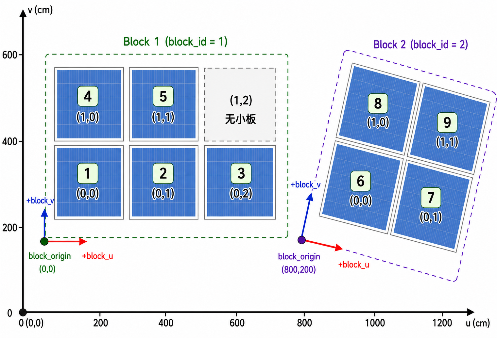

# map_planner 地图表示方案



## 一、目标

本文定义光伏清扫机器人使用的标准地图格式。地图可以由 DWG/CAD 文件转换生成，但机器人和 `map_planner` 运行时只使用转换后的结构化 YAML/JSON 地图，不直接读取 CAD 文件。YAML 和 JSON 使用相同 schema；JSON 导入复用 YAML-like 解析和同一套地图校验逻辑。

核心约定：

- CAD 是几何真值来源，且按真实比例绘制。
- 标准地图坐标统一在 `pv_map`（photovoltaic map，光伏阵列地图）坐标系下，单位为厘米。
- 地图核心清扫对象为大光伏板 `blocks` 和小光伏板 `cells`。
- `bridges` 表示不同 `block` 之间的可通行连接，用于换板和跨 block 转场。
- `block_id`、`cell_id` 和 `bridge_id` 使用全局唯一数字 ID。
- 大板之间不要求规则排布，不要求是行列排布，可以是任意 yaw。
- 每个大板内部建立局部坐标系，用于定义小板行列、内部格子方向和清扫方向。
- 小光伏板内部格子不在 CAD 中绘制，也不逐块存储，只通过全局 `inner_rows` / `inner_cols` 定义。

CAD 解析的核心目标是提取：

1. 小光伏板外轮廓；
2. 大板内部局部坐标系；
3. 大板内小板行列索引；

文字标注、尺寸线、施工辅助线、背景建筑线、支架细节等默认忽略，除非后续明确用于安全或任务规划。

---

## 二、地图总体模型

标准地图采用结构化几何模型：

```text
pv_map
├── frame                 # 地图坐标系定义和 GPS/NED 绑定
├── cell_model            # 全局小板内部格子定义
├── blocks                # 大光伏板 / 连续清扫区域
├── cells                 # 小光伏板
├── bridges               # block 之间的可通行连接
└── metadata/source       # 版本、来源、生成时间等
```

---

## 三、地图与车体坐标系统

### 3.1 pv_map 全局地图坐标系

地图使用全局二维坐标系 `pv_map`：

| 项目 | 说明 |
|------|------|
| 单位 | 厘米 |
| `u` 轴 | 地图固定主轴 |
| `v` 轴 | 与 `u` 垂直的地图固定轴 |
| 原点 | 可取阵列左下角、任务起点或 CAD 解析后的局部原点 |

### 3.2 body 车体坐标系

机器人车体坐标系统一使用 `body`，采用 FRD（Forward-Right-Down）定义：

| 轴 | 方向 |
|----|------|
| `+x` | 机器人前方 |
| `+y` | 机器人右方 |
| `+z` | 机器人下方 |

`body` 用于表达车体相关的视觉观测、边界方向和航向误差。

### 3.3 GPS/NED 绑定关系

与 GPS/NED 的绑定由 `frame.origin` 描述：

```yaml
frame:
  unit: centimeter
  origin:
    latitude_deg: 31.1234567
    longitude_deg: 121.1234567
    yaw_deg: 12.5
```

字段含义：

| 字段 | 含义 |
|------|------|
| `latitude_deg` | `pv_map` 原点纬度 |
| `longitude_deg` | `pv_map` 原点经度 |
| `yaw_deg` | `pv_map +u` 方向相对正北的角度 |

GPS/NED 用于长距离导航、回充和 `pv_map` 全局绑定，不作为光伏板格子定位的主状态。

### 3.4 大板局部坐标系

每个大板内部的小板安装方向应一致，但不同大板的安装方向可以不同。因此每个 `block` 都定义自己的局部坐标系：

```yaml
block_frame:
  block_origin: [0, 0]
  u_axis: [1.0, 0.0]
  v_axis: [0.0, 1.0]
```

| 字段 | 含义 |
|------|------|
| `block_origin` | 大板局部坐标原点在 `pv_map` 中的位置 |
| `u_axis` | 大板局部 `+block_u` 方向在 `pv_map` 中的单位向量 |
| `v_axis` | 大板局部 `+block_v` 方向在 `pv_map` 中的单位向量 |

坐标转换：

```text
p_map = block_origin + block_u_val * u_axis + block_v_val * v_axis
```

其中 `block_u_val` 和 `block_v_val` 是点在大板局部 `block_u/block_v` 轴上的坐标值，单位为 cm；`u_axis/v_axis` 是 `pv_map` 中的单位方向向量。

小板和内部格子的行列约定：

```text
cell_col 沿 +block_u 增加
cell_row 沿 +block_v 增加
inner_col 沿 +block_u 增加
inner_row 沿 +block_v 增加
```

该约定也是 `vision_detect` 根据小板边界更新相邻 `cell_row/cell_col` 的依据。

---

## 四、数据对象

### 4.1 小光伏板内部格子配置 cell_model

`cell_model` 只表达所有小光伏板共享的内部格子定义，不表达小板物理尺寸。小板物理几何由 `cells[].polygon` 表达。不同小板的实际尺寸和安装缝隙可以不同，规划和定位不要依赖固定小板尺寸或固定缝隙；需要显示或几何参考时以 CAD 解析得到的 polygon 为准。

```yaml
cell_model:
  inner_rows: 3
  inner_cols: 6
```

### 4.2 大光伏板定义

大光伏板是任务规划中的区域单位，表示一组安装方向一致、适合连续清扫的小光伏板集合。它不是 CAD 中必须存在的一条外轮廓线，也不要求外形是矩形。

大光伏板的判断依据是：

- 内部小板安装方向一致；
- 内部小板可以放入同一个局部行列网格；
- 小板之间只有较小的正常安装缝隙；

大板内部可以缺少部分小板。每个大板按 `rows × cols` 建立二维数组 `grid`，用 `0/1` 表示对应行列位置是否存在小板。`grid` 只表达行列拓扑和有无小板，不要求小板尺寸一致，也不要求相邻小板缝隙完全一致；实际显示几何以 `cells[].polygon` 为准。

本文中“空板”“缺板”“空位”语义相同，统一表示为 `grid[row][col] == 0`：该行列位置没有实际小板，不是“未清扫”或“有板但禁扫”。空板位置不应出现在 `cells[]` 中，也不应生成 `cell_id`；规划器判断是否有板时以 `grid` 为准。

### 4.3 大光伏板 blocks

`block` 表示一组安装方向一致的小光伏板，是路径规划的主要区域单位。

```yaml
blocks:
  - block_id: 1
    block_frame:
      block_origin: [0, 0]
      u_axis: [1.0, 0.0]
      v_axis: [0.0, 1.0]
    rows: 2
    cols: 3
    grid:
      - [1, 1, 1]
      - [1, 1, 0]
    cell_ids: [1, 2, 3, 4, 5]
    cleanable: true
```

| 字段 | 类型 | 说明 |
|------|------|------|
| `block_id` | uint32 | 大板全局唯一数字 ID |
| `block_frame` | object | 大板局部坐标系 |
| `rows` | int | 大板内部最大行数 |
| `cols` | int | 大板内部最大列数 |
| `grid` | int[][] | 二维占用数组，形状为 `rows × cols`；`1` 表示该 `(row, col)` 存在小板，`0` 表示缺板 |
| `cell_ids` | array | 属于该大板的小光伏板 ID |
| `cleanable` | bool | 是否参与任务规划 |

`rows/cols` 表示该大板内部网格的最大行列范围，也是 `grid` 数组的维度。`grid[row][col]` 可直接查询任意位置是否存在小板；若值为 `0`，表示该位置没有安装小板。

`cell_ids` 只列出 `grid[row][col] == 1` 的实际小板。若 `grid[row][col] == 0`，对应位置不应存在 `cells[]` 记录，地图索引服务查询该位置时应返回 `success=false`。

### 4.4 小光伏板 cells

`cell` 表示一块小光伏板。它的真实几何由 CAD 解析出的 `polygon` 表达。

```yaml
cells:
  - cell_id: 1
    block_id: 1
    row: 0
    col: 0
    polygon:
      - [0, 0]
      - [220, 0]
      - [220, 110]
      - [0, 110]
```

| 字段 | 类型 | 说明 |
|------|------|------|
| `cell_id` | uint32 | 小板全局唯一数字 ID |
| `block_id` | uint32 | 所属大板 ID |
| `row` | int | 在所属大板局部坐标系下的行号 |
| `col` | int | 在所属大板局部坐标系下的列号 |
| `polygon` | array | CAD 解析出的小板四边形顶点，位于 `pv_map` 坐标系；坐标单位由 `frame.unit` 定义 |

当前实现要求小板 `polygon` 使用 4 点四边形表达，顶点按局部格子方向顺序排列：`p00`、`p10`、`p11`、`p01`，分别对应小板局部矩形的 `u_min/v_min`、`u_max/v_min`、`u_max/v_max`、`u_min/v_max` 四个角。内部格子显示和 bridge edge 锚点都会基于这个四边形顺序做插值。

### 4.5 block 间连接 bridges

`bridge` 表示两个 `block` 之间的可通行连接，用于机器人从一个大板切换到另一个大板。静态地图中的 `bridges[]` 只描述已确认可用的桥拓扑、上桥/下桥内部格子锚点，以及可选几何参考。工具自动生成并写入 YAML 的桥使用 `source: auto`，表示它是根据 block 外边界空间邻近关系推断并提升为静态地图候选的桥；运行时临时候选、审批状态、评分和失败原因仍属于规划输出，不写入静态地图。

```yaml
bridges:
  - bridge_id: 1
    source: cad
    endpoints:
      - block_id: 1
        cell_row: 0
        cell_col: 2
        edge: u_max
        inner_row: 1
        inner_col: 5
      - block_id: 2
        cell_row: 0
        cell_col: 0
        edge: u_min
        inner_row: 1
        inner_col: 0
    centerline:
      - [664, 55]
      - [800, 55]
    polygon:
      - [664, 15]
      - [800, 15]
      - [800, 95]
      - [664, 95]
```

| 字段 | 类型 | 说明 |
|------|------|------|
| `bridge_id` | uint32 | 桥全局唯一数字 ID |
| `source` | enum | 可选，桥来源：`cad`、`manual`、`auto`；只说明来源，不表达运行时状态 |
| `endpoints` | array | 桥两端端点，必须正好 2 个 |
| `endpoints[].block_id` | uint32 | 端点所属大板 ID |
| `endpoints[].cell_row/cell_col` | int | 端点连接的小板行列 |
| `endpoints[].edge` | enum | 桥连接到该小板的边：`u_min`、`u_max`、`v_min`、`v_max` |
| `endpoints[].inner_row/inner_col` | int | 机器人上桥/下桥使用的小板内部格子锚点；锚点位于指定 `edge` 上对应内部小格段的中点 |
| `centerline` | array | 可选，桥中心线，位于 `pv_map` 坐标系，单位 cm，仅用于显示或几何参考 |
| `polygon` | array | 可选，桥面可通行区域轮廓，位于 `pv_map` 坐标系，单位 cm，仅用于显示或几何参考 |

机器人接近桥端时，`mission_planner` 应根据当前视觉定位状态，规划到 endpoint 指定的 `block_id + cell_row + cell_col + inner_row + inner_col`。`inner_row/inner_col` 是上桥/下桥锚点，不代表桥宽，也不表示桥只覆盖一个内部小格。

锚点的几何点由 `cell` 的外轮廓、`edge` 和内部格子索引共同确定：先按 `cell_model.inner_rows/inner_cols` 将小板划分为内部小格，再取 endpoint 指定内部小格在指定 `edge` 上对应边段的中点。也就是说，锚点不是内部小格的中心，而是该内部小格贴着桥边缘那一侧的边中点：

```text
u_min: col_ratio = 0.0, row_ratio = (inner_row + 0.5) / inner_rows
u_max: col_ratio = 1.0, row_ratio = (inner_row + 0.5) / inner_rows
v_min: row_ratio = 0.0, col_ratio = (inner_col + 0.5) / inner_cols
v_max: row_ratio = 1.0, col_ratio = (inner_col + 0.5) / inner_cols
```

对于四边形小板，实际 `pv_map` 坐标可由 `cells[].polygon` 双线性插值得到。示例：`edge: u_max, inner_row: 1, inner_col: 5` 表示锚点在该小板 `u_max` 外边上第 `inner_row=1` 段的中点；`inner_col=5` 同时说明该锚点位于最靠近 `u_max` 的内部列。

如果提供桥几何，`centerline` 的两个端点应分别位于两端 endpoint 推导出的 edge 锚点上。`polygon` 表示桥面可通行区域时，推荐按以下约束表达：

- `polygon[3] -> polygon[0]` 是 source 端桥面边，应贴住 source endpoint 指定的 cell edge；
- `polygon[1] -> polygon[2]` 是 target 端桥面边，应贴住 target endpoint 指定的 cell edge；
- `polygon[0] -> polygon[1]` 和 `polygon[3] -> polygon[2]` 是桥的两条侧边，应与 `centerline[0] -> centerline[1]` 平行；
- `centerline[0]` 应为 `polygon[0]` 与 `polygon[3]` 的中点；
- `centerline[1]` 应为 `polygon[1]` 与 `polygon[2]` 的中点。

因此桥的实际宽度、中心线和桥面区域如果需要表达，应由可选 `centerline/polygon` 或运行时 `BridgeCandidate` 的派生几何表达。

`centerline/polygon` 只是几何参考，不作为视觉定位依据。若规划器需要端口几何点，可由 `cells[].polygon + edge + inner_row/inner_col` 在运行时推导，不作为静态地图字段。

`bridges` 是地图拓扑对象。蛇形覆盖路线、候选桥评分和全局路线结果属于规划运行时输出，不作为静态地图真值写入地图文件。若 YAML 没有桥，可使用 `tools/auto_bridge_yaml.py` 根据 cleanable block 的外边界空间邻近关系生成少量 `source: auto` 桥；生成后仍应通过导入校验、bridge transition 和全局规划 smoke test 确认其对当前机器人尺寸可用。

bridge 校验要求：

- `bridge_id` 不重复；
- `endpoints` 必须正好 2 个；
- 两端 `block_id` 必须存在且不同；
- 端点 `cell_row/cell_col` 必须在对应 block 的 `rows/cols` 范围内；
- 对应位置必须存在小板，即 `grid[cell_row][cell_col] == 1`；
- 端点绑定的 `cell` 必须存在于 `cells[]`；
- `edge` 必须是 `u_min/u_max/v_min/v_max`；
- `inner_row/inner_col` 必须在 `cell_model.inner_rows/inner_cols` 范围内；
- 内部格子应和 `edge` 对齐，作为上桥/下桥锚点：`u_min` 通常 `inner_col = 0`，`u_max` 通常 `inner_col = inner_cols - 1`，`v_min` 通常 `inner_row = 0`，`v_max` 通常 `inner_row = inner_rows - 1`；
- 如果提供 `centerline`，至少包含 2 个点；若静态地图提供桥面几何，`centerline[0/1]` 应分别落在两端 endpoint 推导出的 edge 锚点上；
- 如果提供 `polygon`，至少包含 3 个点；推荐使用 4 点四边形，并使端部边贴住小板边、两条侧边平行于 `centerline`、`centerline` 位于桥面中间。

---

## 五、CAD 解析输出要求

### 5.1 需要解析的对象

| CAD 内容 |  输出对象 |
|----------| ---------- |
| 小光伏板外轮廓 |`cells[].polygon` |
| 大板内部局部坐标系 | `blocks[].block_frame` |
| 大板内部最大行列 | `blocks[].rows/cols` |
| 大板内部小板占用关系 | `blocks[].grid` |
| 小板在大板内的行列 | `cells[].row/col` |
| block 间已有桥 | `bridges[].centerline/polygon/endpoints` |

### 5.2 解析流程

```text
DWG/CAD
  -> 图层过滤
  -> 几何单位统一到 cm
  -> 提取小光伏板外轮廓，生成 cells[].polygon
  -> 根据小板几何关系聚类，生成 blocks
  -> 为每个 block 计算 block_frame
  -> 在 block 局部坐标系中为小板排列 row/col
  -> 统计每个 block 的 rows/cols、grid 和 cell_ids
  -> 若 CAD 中包含桥，解析为 bridges[].centerline/polygon/endpoints
  -> 输出标准 YAML/JSON 地图
```

### 5.3 大板聚类规则

- 小板外轮廓尺寸一致或接近；
- 小板方向一致；
- 小板之间间距接近正常安装间隔；
- 小板位置形成同一局部行列结构；
- 小板组之间距离明显大于正常安装间隔时，认为属于不同 block。

### 5.4 桥来源

桥不要求必须来自 CAD。若 CAD 中有明确桥图层，可转换为 `source=cad` 的 `bridges`；若 CAD 中没有桥，可由人工配置为 `source=manual`。自动生成桥候选、评分和选择不属于静态地图格式本身。

---

## 六、标准地图 YAML 示例

```yaml
map_id: 1
version: 1
source:
  type: dwg
  file_name: site_layout.dwg
  generated_at: "2026-05-24T10:00:00Z"

frame:
  unit: centimeter
  origin:
    latitude_deg: 31.1234567
    longitude_deg: 121.1234567
    yaw_deg: 12.5

cell_model:
  inner_rows: 3
  inner_cols: 6

blocks:
  - block_id: 1
    block_frame:
      block_origin: [0, 0]
      u_axis: [1.0, 0.0]
      v_axis: [0.0, 1.0]
    rows: 2
    cols: 3
    grid:
      - [1, 1, 1]
      - [1, 1, 0]
    cell_ids: [1, 2, 3, 4, 5]
    cleanable: true

  - block_id: 2
    block_frame:
      block_origin: [800, 0]
      u_axis: [1.0, 0.0]
      v_axis: [0.0, 1.0]
    rows: 2
    cols: 2
    grid:
      - [1, 1]
      - [1, 0]
    cell_ids: [6, 7, 8]
    cleanable: true

bridges:
  - bridge_id: 1
    source: cad
    endpoints:
      - block_id: 1
        cell_row: 0
        cell_col: 2
        edge: u_max
        inner_row: 1
        inner_col: 5
      - block_id: 2
        cell_row: 0
        cell_col: 0
        edge: u_min
        inner_row: 1
        inner_col: 0
    centerline:
      - [664, 55]
      - [800, 55]
    polygon:
      - [664, 15]
      - [800, 15]
      - [800, 95]
      - [664, 95]

cells:
  - cell_id: 1
    block_id: 1
    row: 0
    col: 0
    polygon:
      - [0, 0]
      - [220, 0]
      - [220, 110]
      - [0, 110]

  - cell_id: 2
    block_id: 1
    row: 0
    col: 1
    polygon:
      - [222, 0]
      - [442, 0]
      - [442, 110]
      - [222, 110]

  - cell_id: 3
    block_id: 1
    row: 0
    col: 2
    polygon:
      - [444, 0]
      - [664, 0]
      - [664, 110]
      - [444, 110]

  - cell_id: 4
    block_id: 1
    row: 1
    col: 0
    polygon:
      - [0, 112]
      - [220, 112]
      - [220, 222]
      - [0, 222]

  - cell_id: 5
    block_id: 1
    row: 1
    col: 1
    polygon:
      - [222, 112]
      - [442, 112]
      - [442, 222]
      - [222, 222]

  - cell_id: 6
    block_id: 2
    row: 0
    col: 0
    polygon:
      - [800, 0]
      - [1020, 0]
      - [1020, 110]
      - [800, 110]

  - cell_id: 7
    block_id: 2
    row: 0
    col: 1
    polygon:
      - [1022, 0]
      - [1242, 0]
      - [1242, 110]
      - [1022, 110]

  - cell_id: 8
    block_id: 2
    row: 1
    col: 0
    polygon:
      - [800, 112]
      - [1020, 112]
      - [1020, 222]
      - [800, 222]
```

在示例中，`rows/cols` 表示大板内部最大局部网格范围，`grid` 按 `rows × cols` 表示每个位置是否存在小板，`cell_ids` 列出实际存在的小板。`block_id=1` 的 `grid[1][2]=0`，表示缺少 `(row=1, col=2)`；`block_id=2` 的 `grid[1][1]=0`，表示缺少 `(row=1, col=1)`。这些位置是空板，规划时应跳过，不生成清扫点，也不能作为视觉初始化目标。

示例 bridge endpoint 中的 `inner_row/inner_col` 表示机器人上桥或下桥前所在的小板内部格子锚点，不代表桥宽；桥宽和桥面范围由可选 `polygon` 或运行时几何判断表达。

定位状态表达为：

```text
block_id
cell_row
cell_col
inner_row
inner_col
```

视觉初始化和视觉定位输出以 `block_id + cell_row + cell_col + inner_row + inner_col` 为主。`cell_id` 可由 `block_id + cell_row + cell_col` 通过地图索引查询得到，用于全局唯一标识、兼容或调试。

---

## 七、ROS2 Service：地图索引查询

以下 Service 由 `mission_planner` 基于当前加载的标准地图提供。`cell_row/cell_col` 对应地图中的 `cells[].row/col`。缺板通过 `success=false` 表达，不通过跳过 `cell_id` 表达。

### `mission_planner/get_cell_index` — 查询小板行列

- **类型**: `mission_planner/srv/GetCellIndex`
- **用途**: 通过 `cell_id` 查询所属大板和大板内行列。

请求字段：

| 字段 | 类型 | 说明 |
|------|------|------|
| `map_id` | uint32 | 当前地图 ID |
| `cell_id` | uint32 | 小板全局唯一 ID |

响应字段：

| 字段 | 类型 | 说明 |
|------|------|------|
| `success` | bool | 是否找到该小板 |
| `message` | string | 失败原因或附加信息 |
| `block_id` | uint32 | 所属大板 ID |
| `cell_row` | int32 | 小板在所属大板内的行号 |
| `cell_col` | int32 | 小板在所属大板内的列号 |

`success=false` 表示该 `cell_id` 不存在、地图未加载、`map_id` 不匹配，或对应位置缺板；调用方不得使用响应中的行列字段。

### `mission_planner/get_cell_id` — 查询小板 ID

- **类型**: `mission_planner/srv/GetCellId`
- **用途**: 通过 `block_id + cell_row + cell_col` 查询对应小板 ID。

请求字段：

| 字段 | 类型 | 说明 |
|------|------|------|
| `map_id` | uint32 | 当前地图 ID |
| `block_id` | uint32 | 大板 ID |
| `cell_row` | int32 | 目标行号 |
| `cell_col` | int32 | 目标列号 |

响应字段：

| 字段 | 类型 | 说明 |
|------|------|------|
| `success` | bool | 是否存在对应小板 |
| `message` | string | 失败原因或附加信息 |
| `cell_id` | uint32 | 小板全局唯一 ID |

`success=false` 表示 `block_id` 不存在、行列越界、目标位置缺板、地图未加载或 `map_id` 不匹配；调用方不得更新到该 `cell_id`。
